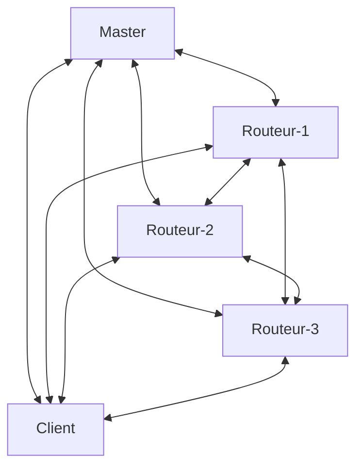

# SAé 302
SAE302 - Conception d'une architecture distribuée avec routage en oignon.
Pour plus d'informations : https://atlantide-pictures.github.io/portfolio/but2rt/sae302/index.html 

## Description
Dans le cadre de l'obtention du BUT Réseaux et Télécommunications, il nous a été demandé pour notre deuxième projet, de concevoir une architecture distribuée avec un routage en oignon.

### Exemple d'architecture
L'architecture voulue par le professeur est dite en mersh, tout le monde est relié ensemble.

### Exemple de circuit d'un message
Le client est le seul à décider de la route que va prendre le message. Aucun des routeurs ne connaît ni le récepteur, ni le transmetteur dudit message. Chaque routeur ne connaît que celui qui le précède et qui le succède.
